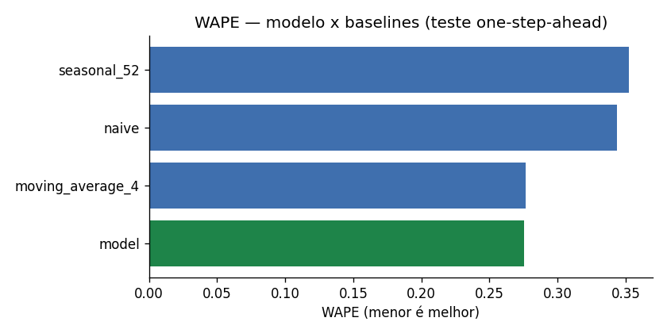
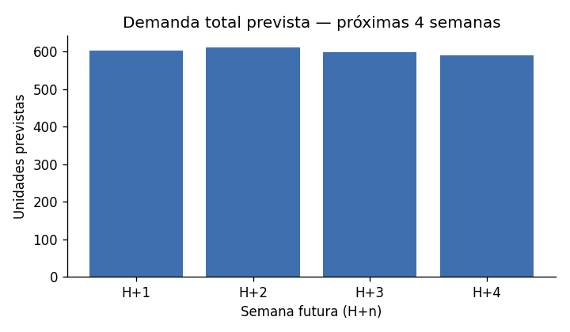
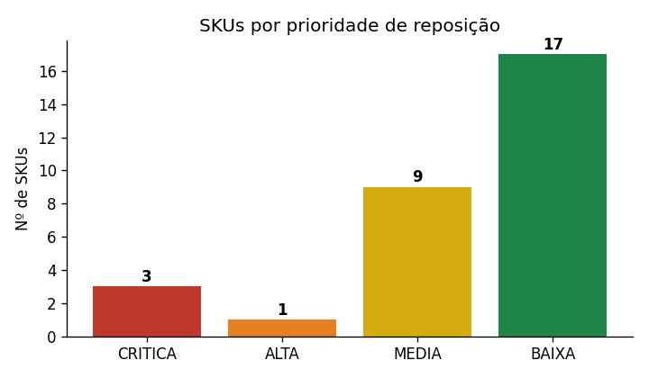
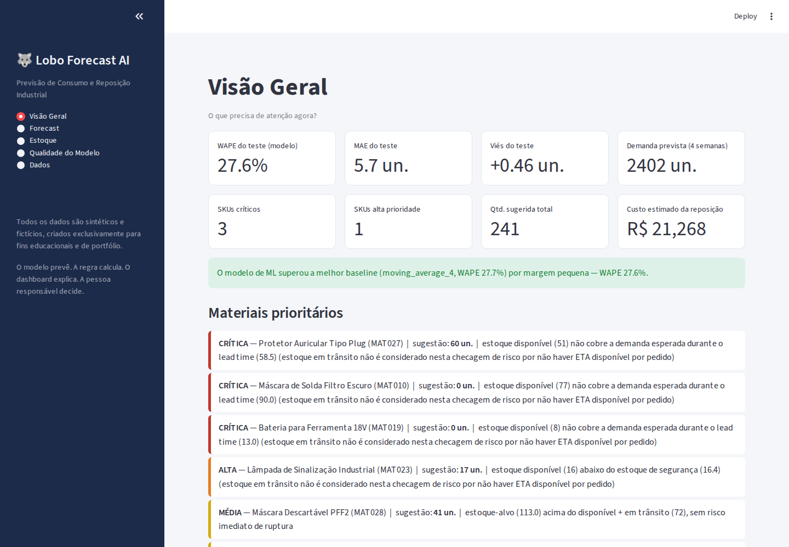
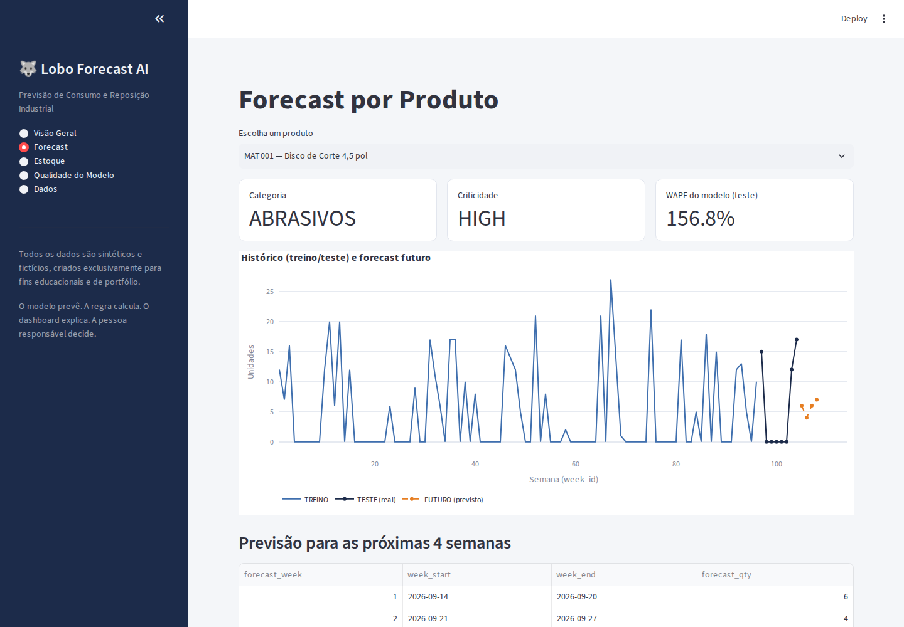
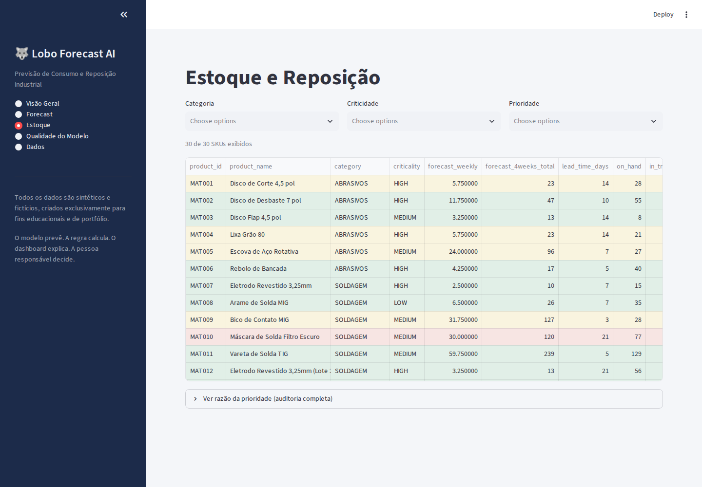
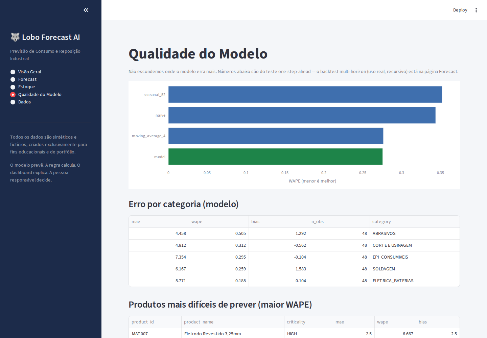
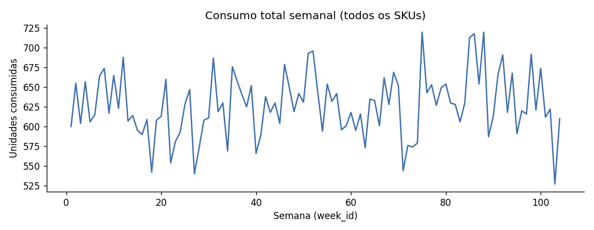
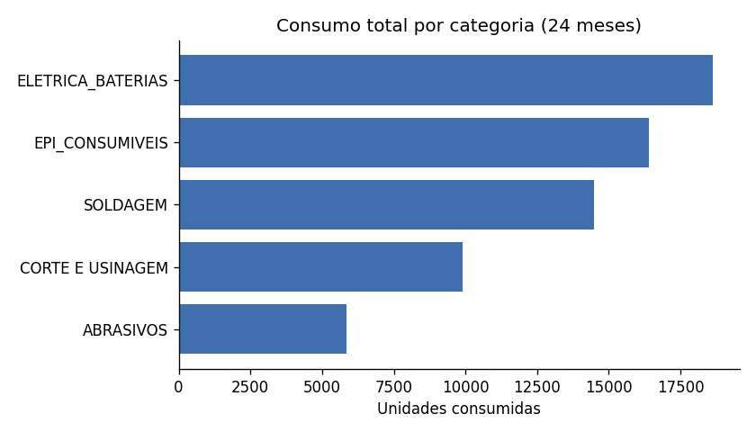

# 🐺 Lobo Forecast AI

**Projeto Lobo 2 — Lobo Forecast AI** · Previsão de Consumo e Reposição Industrial

Sistema analítico desenvolvido com Python, SQL e Machine Learning para
prever consumo de materiais industriais, identificar riscos de ruptura e
gerar sugestões auditáveis de reposição de estoque.

> **Todos os dados utilizados neste projeto são sintéticos e foram criados
> exclusivamente para fins educacionais e de portfólio.** Nenhum dado real
> de empresa, colaborador, fornecedor ou processo interno foi utilizado.

**Status: V1.1.1 — Performance & Final Verification.** Pipeline completo,
testado e reprodutível de ponta a ponta: dados sintéticos → SQL → EDA →
forecast → backtest multi-horizon (otimizado, ~3x mais rápido, mesma
metodologia e mesmos números da V1.1) → motor de reposição → dashboard → CI.

---

## Resultado em uma frase

Um modelo RandomForest, avaliado sob **dois** protocolos temporais
honestos (sem embaralhar dados, sem vazamento), supera a melhor baseline
por margem pequena no teste one-step-ahead (WAPE 27,56% vs. 27,66%) e no
backtest multi-horizon consolidado — mas a média móvel de 4 semanas
**vence o modelo em H+3 e H+4** no backtest recursivo, por margem também
pequena. Isso é reportado sem maquiagem nos dois sentidos. O motor de
reposição resultante identificou **3 SKUs críticos** entre 30, com sugestão
de reposição auditável linha a linha.

## Problema

Um almoxarifado/ferramentaria industrial fictício abastece áreas
operacionais (manutenção, soldagem, fabricação, mecânica, elétrica) com
materiais e consumíveis. A gestão quer antecipar a demanda das próximas
semanas e revisar a reposição antes de possíveis rupturas — sem depender
de decisão automática.

**Regra central do produto:**
> O modelo prevê. A regra calcula. O dashboard explica. A pessoa
> responsável decide.

## Arquitetura

```
GERAR DADOS → VALIDAR → CRIAR BANCO SQL → SÉRIE SEMANAL → FEATURES
    → BASELINES + MODELO ML → AVALIAÇÃO ONE-STEP-AHEAD
    → BACKTEST MULTI-HORIZON (H+1..H+4) → FORECAST 4 SEMANAS
    → MOTOR DE REPOSIÇÃO → DASHBOARD (Streamlit)
```

Detalhes completos (com o motivo de cada decisão de design) em
`docs/ARCHITECTURE.md`.

## Dados sintéticos (resumo)

| Tabela | Linhas | Descrição |
|---|---|---|
| products | 30 | Catálogo de SKUs fictícios (5 categorias industriais) |
| calendar | 108 | 104 semanas conhecidas + 4 semanas futuras |
| consumption | 5.450 | Transações de retirada de material |
| inventory_snapshot | 3.120 | Posição semanal de estoque por SKU |

Gerados com semente fixa (`RANDOM_SEED = 42`) — 100% reprodutíveis.
Dicionário completo em `docs/DATA_DICTIONARY.md`.

## Protocolo temporal (sem vazamento)

- Nenhum split aleatório: teste sempre pelas últimas 8 semanas conhecidas
  (walk-forward).
- Semanas sem consumo permanecem na série com valor zero — não são
  removidas (11,6% das combinações produto-semana são zero real).
- Toda feature de lag/rolling usa `shift(1)` antes de `rolling()`, testado
  explicitamente em `tests/test_forecasting.py`.

## Resultados — teste one-step-ahead (últimas 8 semanas conhecidas)

| Método | MAE | WAPE | Viés |
|---|---|---|---|
| **RandomForest (modelo)** | **5.71** | **27.56%** | +0.46 |
| Média móvel 4 semanas | 5.73 | 27.66% | +0.38 |
| Naive (última semana) | 7.13 | 34.38% | +0.04 |
| Sazonal (52 semanas) | 7.30 | 35.22% | +1.00 |



O modelo superou a melhor baseline por margem pequena — reportado como
está, sem inflar o resultado. **Este teste não reflete o uso real do
sistema** (forecast recursivo de 4 semanas) — para isso, veja o backtest
multi-horizon logo abaixo. Detalhes completos, inclusive onde o modelo
falha mais (SKUs intermitentes/baixo giro), em `docs/MODEL_CARD.md`.

## Backtest multi-horizon (rolling-origin, H+1 a H+4) — V1.1

Avalia o cenário REAL de uso: forecast recursivo de 4 semanas, testado em
41 origens temporais diferentes dentro do histórico, sob o mesmo
protocolo para o modelo e as baselines.

| Horizonte | Método vencedor | WAPE do vencedor | WAPE do modelo |
|---|---|---|---|
| H+1 | **RandomForest** | 24.14% | 24.14% |
| H+2 | **RandomForest** | 24.78% | 24.78% |
| H+3 | **Média móvel 4 semanas** | 25.38% | 25.68% |
| H+4 | **Média móvel 4 semanas** | 25.34% | 25.81% |
| ALL (consolidado) | **RandomForest** | 25.10% | 25.10% |

O modelo vence nos horizontes mais próximos, mas a baseline simples o
ultrapassa em H+3/H+4 — por margem pequena. Reportado como saiu, sem
favorecer nenhum dos dois lados. Metodologia e tabela completa em
`docs/MODEL_CARD.md`.



## Motor de reposição (resultado real do cenário atual)

| Prioridade | Nº de SKUs | Significado |
|---|---|---|
| CRÍTICA | 3 | risco de ruptura antes da reposição chegar |
| ALTA | 1 | estoque abaixo da segurança |
| MÉDIA | 9 | reposição sugerida, sem ruptura imediata |
| BAIXA | 17 | disponível + em trânsito cobre demanda + segurança + revisão |



Custo estimado total de reposição sugerida (fictício): **R$ 21.268,45**.
Toda sugestão é auditável — `results/replenishment_suggestions.csv` traz,
por SKU, a fórmula completa e a **razão em texto** da prioridade. Nada de
"IA recomenda X" sem mostrar o cálculo.

> **Por que os números mudaram desde a V1.0:** a auditoria da V1.1
> corrigiu um desalinhamento temporal no `inventory_snapshot` (o snapshot
> de fim de semana estava registrado ANTES dos movimentos daquela própria
> semana — ver `docs/DATA_DICTIONARY.md`). Com a posição de estoque agora
> correta, o cenário real ficou mais apertado do que o relatado
> anteriormente (1 crítico, 0 alta, 7 média, 22 baixa) — não foi um ajuste
> para "piorar" o resultado, foi a correção de um bug real que subestimava
> o risco de ruptura.

## Dashboard (Streamlit)

```bash
cd Projeto_Lobo_2_Lobo_Forecast_AI_v1.1.1/src
streamlit run app.py
```

5 páginas: **Visão Geral** (KPIs, materiais prioritários, real x previsto),
**Forecast** (histórico/teste/futuro por produto), **Estoque** (tabela
auditável com filtros), **Qualidade do Modelo** (modelo x baselines, erro
por categoria/SKU) e **Dados** (perfil do dataset sintético).

| Visão Geral | Forecast |
|---|---|
|  |  |

| Estoque | Qualidade do Modelo |
|---|---|
|  |  |

## EDA (resumo visual)




Exploração completa, com fato observado separado de hipótese, em
`notebooks/02_eda.ipynb`.

## Como executar (pasta limpa, testado do zero)

```bash
cd Projeto_Lobo_2_Lobo_Forecast_AI_v1.1.1
pip install -r requirements.txt   # versões fixas — ver .python-version (3.12)

python src/generate_data.py        # gera data/raw/*.csv (dados sintéticos)
python src/validate_data.py        # valida integridade e ausência de PII
python src/database.py             # recria database/lobo_forecast.db e carrega os dados
python src/data_prep.py            # constrói a série semanal produto x semana
python src/run_evaluation.py       # treina o modelo, roda a avaliação one-step-ahead
python src/backtest_multihorizon.py  # backtest rolling-origin H+1..H+4 (~40s, medido — ver docs/PERFORMANCE_AUDIT.md)
python src/forecast.py             # gera o forecast recursivo das próximas 4 semanas
python src/replenishment.py        # calcula estoque-alvo, quantidade sugerida e prioridade

pytest tests/ -v                   # roda os 64 testes automatizados (~15s)
ruff check src/ tests/             # lint — 0 problemas

cd src && streamlit run app.py     # abre o dashboard em http://localhost:8501
```

> **Importante:** rodar `pytest` inclui um smoke test reduzido do backtest
> multi-horizon, mas ele grava em um diretório temporário isolado — nunca
> sobrescreve `results/backtest_multihorizon_summary.csv`. Ainda assim, se
> você rodar os testes ANTES do passo `backtest_multihorizon.py` acima, os
> resultados de produção só existirão depois de rodar esse comando pelo
> menos uma vez.

Para explorar as consultas SQL de negócio:

```bash
sqlite3 database/lobo_forecast.db < sql/analysis_queries.sql
```

Este fluxo foi executado do zero em pasta limpa múltiplas vezes durante o
desenvolvimento (um clone novo, sem nenhum estado anterior) — ver
`docs/TEST_REPORT.md`.

## Qualidade e testes

- **64 testes automatizados** (pytest, ~15s): dados, banco/FKs/constraints,
  ausência de vazamento temporal, semântica temporal do estoque, baselines,
  métricas, motor de reposição, integração do pipeline completo, smoke
  test do dashboard, smoke test isolado do backtest multi-horizon
  (com prova matemática de que a versão otimizada em lote é idêntica à
  original produto-a-produto) e regressão numérica contra os valores de
  referência já auditados.
- **Lint limpo** (`ruff check`): 0 problemas (comando executado de fato,
  não apenas declarado — ver `docs/TEST_REPORT.md`).
- **CI** com GitHub Actions (`.github/workflows/ci.yml`), dois jobs:
  `fast-suite` (lint + pipeline essencial + testes, todo push/PR, ~1 min)
  e `full-release-validation` (pipeline + backtest completo, só sob
  demanda). Ainda não publicada no GitHub.
- **Backtest multi-horizon ~3x mais rápido** (121,4s → ~41s) que a V1.1,
  com regressão numérica verificada como exatamente zero — ver
  `docs/PERFORMANCE_AUDIT.md`.
- **3 notebooks executados de verdade** (`notebooks/`), com outputs reais
  embutidos: qualidade de dados, EDA e análise do modelo.
- Reprodutibilidade confirmada em pasta limpa a cada versão entregue, com
  dependências fixadas (`requirements.txt` com `==`, `.python-version`).

## Documentos

| Documento | Conteúdo |
|---|---|
| `docs/DATA_DICTIONARY.md` | Tabelas, colunas, tipos e regras |
| `docs/ARCHITECTURE.md` | Componentes, fluxo do pipeline e por quê de cada decisão |
| `docs/MODEL_CARD.md` | Modelo, protocolo temporal, métricas reais, onde falha |
| `docs/LIMITATIONS.md` | O que o estudo não modela |
| `docs/TEST_REPORT.md` | Testes executados e resultado real |
| `docs/PERFORMANCE_AUDIT.md` | Otimização do backtest (V1.1.1): antes x depois, tempos reais, regressão numérica |
| `docs/FINAL_VERIFICATION.md` | Checklist final de verificação da V1.1.1 (ambiente, comandos, resultados) |
| `docs/CHANGELOG.md` | Evolução das versões (V0.1 → V1.1.1) |
| `docs/PORTFOLIO_NOTES.md` | Como explicar o projeto em currículo/entrevista |

## Limitações

Resumo (completo em `docs/LIMITATIONS.md`): não modela lote mínimo de
compra, contratos com fornecedor, validade de materiais, armazenagem
física nem urgências operacionais reais. `service_factor` é único para
todos os SKUs (não varia por criticidade). Sem ETA por pedido, a
classificação de risco de ruptura ignora deliberadamente `in_transit`
(abordagem conservadora — ver `LIMITATIONS.md`). A avaliação
one-step-ahead e o backtest multi-horizon medem coisas diferentes e não
devem ser comparados diretamente. A reposição é sempre uma **sugestão
auditável**, nunca uma compra automática — a decisão final é humana.

## Próximos passos (fora do escopo desta versão)

- Croston/SBA para os SKUs mais intermitentes, se uma necessidade real
  aparecer (nesta base, a média móvel já foi competitiva mesmo no
  backtest multi-horizon).
- `service_factor` diferenciado por criticidade do SKU.
- ETA por pedido em trânsito, para poder considerar `in_transit` na
  classificação de risco de ruptura com segurança (ver `LIMITATIONS.md`).
- Publicar o workflow de CI no GitHub (já está pronto localmente).
- Deploy do dashboard (Streamlit Community Cloud ou similar).
